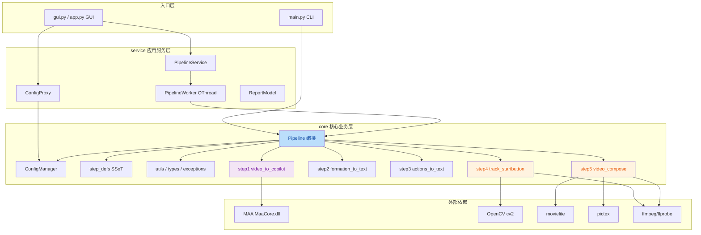
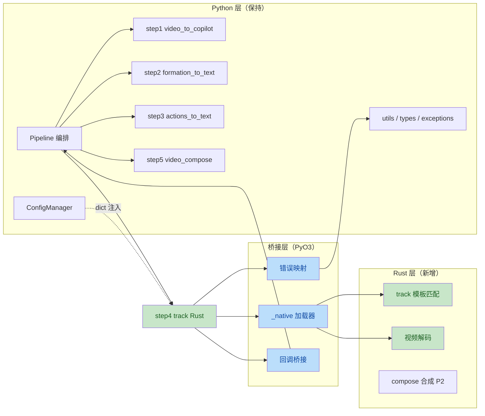
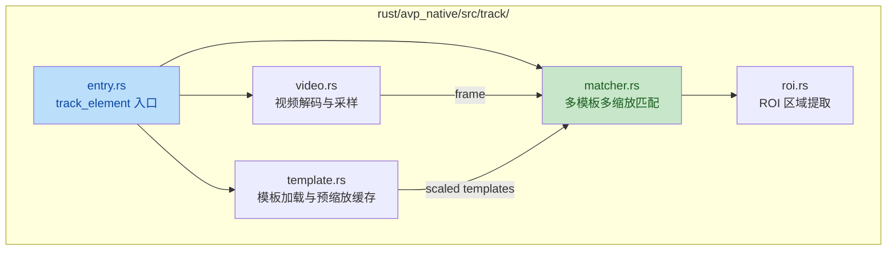
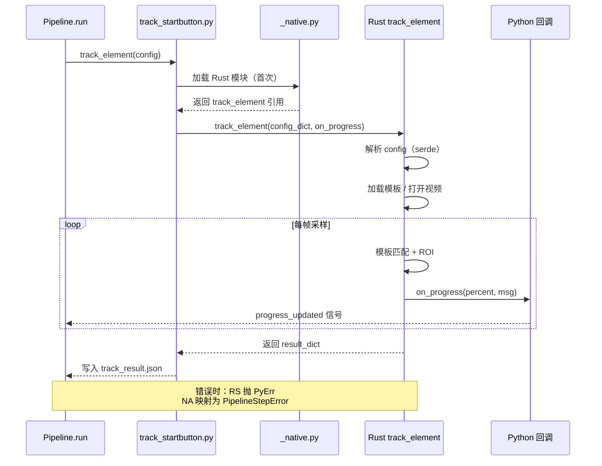

# ArknightsVideoPipeline 项目架构分析与 Rust 后台模块集成方案

> 本报告仅提供重构建议方案，不包含实际代码修改。所有路径与目录命名均为建议，最终落地需结合团队实际情况评估。

---

## 一、现状评估

### 1.1 项目概览

ArknightsVideoPipeline 是一个基于 Python 3.12+ 的明日方舟战斗视频自动化处理流水线，由 5 个步骤组成：视频转 MAA 作业 JSON → 编队文本提取 → 操作文本提取 → 开始按钮时间戳识别 → 视频合成。同时提供 CLI（[main.py](file:///c:/Users/Mon3tr/Desktop/ArknightsVideoPipeline-dev/main.py)）与 GUI（基于 PyQt6）两种入口。

### 1.2 现有目录结构

```
ArknightsVideoPipeline-dev/
├── main.py                    # CLI 入口
├── gui.py                     # GUI 入口（占位/转发）
├── pyproject.toml             # 项目元数据 + setuptools 构建
├── requirements.txt           # 与 pyproject 同步的依赖清单
├── resource/                  # 模板图片、字体
├── docs/                      # 用户文档
├── script/
│   └── build_exe/             # PyInstaller 打包工具链
│       ├── builder.py         #   构建管理器
│       ├── analyzer.py        #   AST 依赖分析
│       ├── launchers.py       #   入口脚本生成
│       └── runtime_hook.py    #   运行时钩子（ffmpeg PATH 修复）
└── src/
    └── arknights_video_pipeline/
        ├── core/              # 核心业务逻辑
        │   ├── pipeline.py          # 流水线编排（约 940+ 行）
        │   ├── config.py            # 统一配置管理
        │   ├── step_defs.py         # 步骤元数据 SSoT
        │   ├── types.py             # dataclass 数据结构
        │   ├── exceptions.py        # 异常层次
        │   ├── utils.py             # 路径/IO/ffprobe 工具
        │   ├── logger.py            # 日志配置
        │   ├── video_to_copilot.py  # 步骤1：MAA 视频识别
        │   ├── formation_to_text.py # 步骤2：编队文本
        │   ├── actions_to_text.py   # 步骤3：操作文本
        │   ├── track_startbutton.py # 步骤4：模板匹配
        │   ├── video_compose.py     # 步骤5：合成 style1
        │   ├── video_compose_style2.py
        │   └── video_compose_common.py
        ├── service/           # 应用服务层（GUI 与 core 之间）
        │   ├── config_proxy.py      # 配置代理
        │   ├── pipeline_service.py  # 流水线服务
        │   ├── pipeline_worker.py   # QThread 工作线程
        │   └── report_model.py      # 报告展示模型
        └── gui/               # PyQt6 UI 层
            ├── app.py
            ├── main_window.py
            ├── components/    # 可复用控件
            ├── theme/         # Material Design 主题
            ├── workers/       # （未使用的旧目录）
            └── assets/        # 图标资源
```

### 1.3 架构亮点

| 维度 | 现状评价 | 说明 |
|---|---|---|
| 分层清晰度 | ★★★★☆ | core/service/gui 三层职责明确，依赖方向正确 |
| 步骤元数据 | ★★★★★ | [step_defs.py](file:///c:/Users/Mon3tr/Desktop/ArknightsVideoPipeline-dev/src/arknights_video_pipeline/core/step_defs.py) 作为 SSoT，被 GUI/Worker/Report 复用 |
| 配置管理 | ★★★★☆ | [config.py](file:///c:/Users/Mon3tr/Desktop/ArknightsVideoPipeline-dev/src/arknights_video_pipeline/core/config.py) 提供白名单 CLI 覆盖、深浅合并策略 |
| 回调解耦 | ★★★★☆ | [pipeline.py](file:///c:/Users/Mon3tr/Desktop/ArknightsVideoPipeline-dev/src/arknights_video_pipeline/core/pipeline.py) 通过 `on_step_start/on_step_finish/is_cancelled` 钩子避免 monkey-patch |
| 异常层次 | ★★★★☆ | [exceptions.py](file:///c:/Users/Mon3tr/Desktop/ArknightsVideoPipeline-dev/src/arknights_video_pipeline/core/exceptions.py) 提供分级异常，便于精确捕获 |
| 打包流程 | ★★★☆☆ | [build_exe](file:///c:/Users/Mon3tr/Desktop/ArknightsVideoPipeline-dev/script/build_exe) 工具链完整但仅面向纯 Python |

### 1.4 现有架构关系图



> 标橙色为性能热点（CPU/IO 密集），标紫色为外部进程调用，标蓝色为编排核心。

### 1.5 性能特征与 Rust 改造优先级评估

| 模块 | 文件 | 计算特征 | 当前实现痛点 | Rust 改造收益 | 优先级 |
|---|---|---|---|---|---|
| 开始按钮跟踪 | [track_startbutton.py](file:///c:/Users/Mon3tr/Desktop/ArknightsVideoPipeline-dev/src/arknights_video_pipeline/core/track_startbutton.py) | CPU 密集（多模板多缩放匹配）、IO 密集（逐帧解码） | Python GIL 限制并行；ThreadPoolExecutor 仅缓解；逐帧 cv2 调用开销大 | 极高（可直接用 `image`/`opencv-rust`/`rayon` 并行） | P0 |
| 视频合成 | [video_compose.py](file:///c:/Users/Mon3tr/Desktop/ArknightsVideoPipeline-dev/src/arknights_video_pipeline/core/video_compose.py) | CPU+IO 密集（编码、合成、文本渲染） | 依赖 movielite/pictex，Python 层只是粘合 | 中（需先评估是否替换底层库） | P2 |
| 视频转 Copilot | [video_to_copilot.py](file:///c:/Users/Mon3tr/Desktop/ArknightsVideoPipeline-dev/src/arknights_video_pipeline/core/video_to_copilot.py) | 外部进程调用（MAA DLL） | 已通过 Python ctypes-like 接口调用 MAA | 低（瓶颈在 MAA 本身） | P3 |
| 编队/操作文本 | formation_to_text / actions_to_text | 纯 Python 字符串拼接 | 计算量极小 | 极低（改造收益不抵成本） | 不建议 |
| 配置/工具 | config.py / utils.py | IO 与序列化 | 已足够轻量 | 低 | 不建议 |

**结论**：Rust 改造应聚焦于 `track_startbutton` 这类 CPU 密集型步骤，文本处理与编排层保持 Python 即可。

---

## 二、Rust 集成面临的现状约束

在对项目进行 Rust 化改造前，以下现有设计决策必须纳入考虑：

### 2.1 关键约束清单

| 约束 | 位置 | 对 Rust 集成的影响 |
|---|---|---|
| `PROJECT_ROOT` 动态查找 | [utils.py:_find_project_root](file:///c:/Users/Mon3tr/Desktop/ArknightsVideoPipeline-dev/src/arknights_video_pipeline/core/utils.py) | Rust 侧需通过参数注入而非全局变量获取根目录 |
| `PROJECT_ROOT` 打包时 patch | [launchers.py](file:///c:/Users/Mon3tr/Desktop/ArknightsVideoPipeline-dev/script/build_exe/launchers.py) | Rust 编译产物需同样感知打包环境 |
| ffmpeg PATH 修复 | [utils.py:ensure_ffmpeg_in_path](file:///c:/Users/Mon3tr/Desktop/ArknightsVideoPipeline-dev/src/arknights_video_pipeline/core/utils.py) | Rust 侧应在调用前由 Python 注入 PATH，而非重复实现注册表逻辑 |
| 配置 JSON 单一事实源 | [config.py:PIPELINE_DEFAULTS](file:///c:/Users/Mon3tr/Desktop/ArknightsVideoPipeline-dev/src/arknights_video_pipeline/core/config.py) | Rust 不应维护独立配置副本，应接收 Python 传入的 dict |
| 步骤元数据 SSoT | [step_defs.py](file:///c:/Users/Mon3tr/Desktop/ArknightsVideoPipeline-dev/src/arknights_video_pipeline/core/step_defs.py) | Rust 模块名/键名必须与 `STEPS` 表一致，否则破坏 GUI 信号链 |
| 回调钩子协议 | [pipeline.py:Pipeline.__init__](file:///c:/Users/Mon3tr/Desktop/ArknightsVideoPipeline-dev/src/arknights_video_pipeline/core/pipeline.py) | Rust 步骤需通过回调桥接进度，不能直接发射 Qt 信号 |
| `StepResult` 数据结构 | [types.py](file:///c:/Users/Mon3tr/Desktop/ArknightsVideoPipeline-dev/src/arknights_video_pipeline/core/types.py) | Rust 输出需可序列化为该结构，便于 `report.to_dict()` |
| 异常类型分层 | [exceptions.py](file:///c:/Users/Mon3tr/Desktop/ArknightsVideoPipeline-dev/src/arknights_video_pipeline/core/exceptions.py) | Rust 错误需映射为 `PipelineStepError`，保留 `step_name/step_index/cause` |
| PyInstaller 打包 | [builder.py](file:///c:/Users/Mon3tr/Desktop/ArknightsVideoPipeline-dev/script/build_exe/builder.py) | Rust 动态库需通过 `--add-binary` 打包，平台后缀需正确 |
| 资源目录相对路径 | resource/StartButton 等 | Rust 侧应接收绝对路径，避免重复实现路径解析 |

### 2.2 不应改动的边界

为保证 GUI/Service 层零改动，以下接口契约必须保持稳定：

1. `Pipeline.step_xxx()` 方法签名与返回值（`StepResult`）
2. `STEPS` / `STEPS_BY_KEY` / `STEPS_BY_METHOD` 的键名
3. `PipelineReport.to_dict()` 输出格式
4. `ConfigManager` 的 `pipeline` dict 字段名

---

## 三、重构方案总览

### 3.1 总体设计原则

1. **渐进式替换**：保留 Python 编排层，仅将性能热点模块替换为 Rust 实现。
2. **薄包装原则**：Rust 模块通过 PyO3 暴露与原 Python 函数签名一致的接口，使 `Pipeline` 调用方零感知。
3. **配置不重复**：所有配置由 Python `ConfigManager` 持有，调用 Rust 时序列化传入。
4. **资源路径注入**：所有文件路径在 Python 侧解析为绝对路径后传入 Rust。
5. **错误统一映射**：Rust 错误通过 PyO3 自定义异常映射到 `PipelineStepError`。
6. **构建可独立**：Rust 子项目可独立 `cargo build`，并通过 `maturin` 与 Python 包协同发布。

### 3.2 目标目录结构

```
ArknightsVideoPipeline-dev/
├── main.py
├── gui.py
├── pyproject.toml                  # 新增 maturin 构建后端配置
├── requirements.txt
├── Cargo.toml                      # 【新增】Rust workspace 根
├── rust-toolchain.toml             # 【新增】固定工具链版本
├── resource/
├── docs/
│   └── architecture.md             # 【新增】架构说明
├── script/
│   └── build_exe/
│       ├── builder.py              # 修改：支持 --add-binary 打包 .dll/.so/.pyd
│       ├── analyzer.py
│       ├── launchers.py
│       └── runtime_hook.py
├── rust/                           # 【新增】Rust 源码根
│   └── avp_native/                 # 单 crate（初期）
│       ├── Cargo.toml
│       ├── pyproject.toml          # maturin 子配置
│       ├── src/
│       │   ├── lib.rs              # PyO3 模块入口
│       │   ├── error.rs            # 错误类型 + 异常映射
│       │   ├── config.rs           # Python dict -> Rust 配置反序列化
│       │   ├── track/              # 步骤4：开始按钮跟踪
│       │   │   ├── mod.rs
│       │   │   ├── matcher.rs      #   模板匹配核心
│       │   │   ├── template.rs     #   模板加载与预缩放
│       │   │   ├── roi.rs          #   ROI 搜索
│       │   │   └── video.rs        #   视频解码（ffmpeg-next）
│       │   └── compose/            # 步骤5：视频合成（P2 阶段）
│       │       └── mod.rs
│       └── tests/
│           ├── track_test.rs
│           └── fixtures/
└── src/
    └── arknights_video_pipeline/
        ├── core/
        │   ├── pipeline.py
        │   ├── config.py
        │   ├── step_defs.py
        │   ├── types.py
        │   ├── exceptions.py
        │   ├── utils.py
        │   ├── logger.py
        │   ├── video_to_copilot.py
        │   ├── formation_to_text.py
        │   ├── actions_to_text.py
        │   ├── track_startbutton.py     # 改为薄包装：优先 import Rust 实现
        │   ├── video_compose.py
        │   ├── video_compose_style2.py
        │   ├── video_compose_common.py
        │   └── _native.py               # 【新增】统一 Rust 模块加载与回退
        ├── service/
        └── gui/
```

### 3.3 边界划分总览图



> 标绿为 Rust 实现，标蓝为 PyO3 桥接层，其余保持 Python。

---

## 四、详细方案

### 4.1 Rust 模块边界划分

#### 4.1.1 必须纳入 Rust 的模块

| 步骤 | 原 Python 实现 | Rust 模块路径 | 理由 |
|---|---|---|---|
| step4 模板匹配 | [track_startbutton.py](file:///c:/Users/Mon3tr/Desktop/ArknightsVideoPipeline-dev/src/arknights_video_pipeline/core/track_startbutton.py) | `rust/avp_native/src/track/` | CPU 密集，GIL 限制明显；可借助 `rayon` 数据并行；模板预计算与 ROI 搜索天然适合 Rust |

#### 4.1.2 暂不纳入 Rust 的模块

| 步骤 | 理由 |
|---|---|
| step1 video_to_copilot | 瓶颈在 MAA 自身，Python 仅是粘合层；MAA 升级时 Python 接口可能变化，Rust 化反而增加维护成本 |
| step2/step3 文本转换 | 计算量极小，字符映射逻辑用 Python 更易迭代 |
| step5 video_compose | 强依赖 movielite/pictex 的 Python API；若要 Rust 化需先评估替换为 `ffmpeg-next` 的工作量，列为 P2 |

#### 4.1.3 Rust 模块内部结构（以 track 为例）



#### 4.1.4 Python 侧薄包装设计

`track_startbutton.py` 改造为优先调用 Rust 实现，失败时回退到原 Python 实现（保证渐进迁移期可用性）：

```
core/track_startbutton.py
├── try: from ._native import track_element as _rust_track
├── except ImportError: _rust_track = None
├── def track_element(config):
│     if _rust_track:
│         return _rust_track(config, on_progress=...)
│     return _track_element_python(config)   # 原 Python 实现
└── def _track_element_python(config): ...
```

`core/_native.py` 集中管理 Rust 模块加载、版本兼容性检查、错误映射，避免散落各处。

### 4.2 跨语言通信机制架构

#### 4.2.1 选型对比

| 方案 | 调用开销 | 实现复杂度 | 进度回调 | 错误传递 | 打包兼容 | 推荐度 |
|---|---|---|---|---|---|---|
| **PyO3 原生扩展（.pyd/.so）** | 极低（同进程） | 中 | 通过 Python 回调 | 自定义异常直接映射 | 需 `--add-binary` | ★★★★★ |
| Subprocess + JSON stdin/stdout | 高（进程启动+序列化） | 低 | 通过 stdout 行 | 退出码+错误 JSON | 需打包二进制 | ★★☆☆☆ |
| ctypes/cffi 调用 C ABI | 低 | 高（需手写 FFI） | 难（需回调注册） | 难 | 需 `.dll` | ★★☆☆☆ |
| gRPC/IPC | 极高 | 极高 | 流式 RPC | status code | 需独立服务 | ★☆☆☆☆ |

**选型结论**：采用 **PyO3 + Maturin** 原生扩展方案。理由：
- 与现有 `Pipeline.run()` 同步调用模式契合
- 通过 `PyPyObject` 可直接接收 Python dict、回调函数
- 错误通过 `PyErr` 直接映射为 Python 异常
- Maturin 与 setuptools 可共存于同一 `pyproject.toml`

#### 4.2.2 调用时序



#### 4.2.3 数据交换契约

为保证 Python/Rust 两侧数据一致，定义以下 serde 结构（伪代码）：

```rust
// 对应 Python DEFAULT_CONFIG
struct TrackConfig {
    video_source: String,           // 绝对路径
    resource_dir: String,           // 绝对路径
    match_threshold: f32,
    scale_range: [f32; 2],
    scale_steps: u32,
    detection_fps: f32,
    detection_time_limit: Option<f32>,
    auto_downscale: bool,
    downscale_target_height: u32,
    min_consecutive_frames: u32,
    use_grayscale: bool,
    use_roi: bool,
    roi_padding: u32,
    roi_search_expand: f32,
    early_stop_threshold: f32,
    max_workers: u32,               // rayon 线程池
    debug_mode: bool,
    output_result: bool,
}

// 对应 Python track_result.json
struct TrackResult {
    was_detected: bool,
    first_appear_time: Option<f32>,
    disappear_time: Option<f32>,
    last_seen_time: Option<f32>,
    max_confidence: f32,
    duration_visible: f32,
    match_count: u32,
    best_template: String,
    best_frame: u32,
}
```

关键原则：
- **路径字段一律绝对路径**：由 Python 侧 `resolve_project_path` 处理后传入
- **时间字段单位为秒（f32）**：与现有 JSON 一致
- **可选字段用 `Option<T>`**：对应 Python `None`

#### 4.2.4 错误映射

在 `rust/avp_native/src/error.rs` 中定义：

```
Rust 错误枚举                  →  Python 异常
─────────────────────────────────────────────
VideoOpenError                 →  VideoValidationError
TemplateLoadError              →  PipelineStepError(step="track")
ConfigInvalidError             →  ConfigError
MatchTimeoutError              →  MAARecognitionError（或新增 TrackError）
IoError                        →  PipelineError
```

通过 `#[pyfunction]` 的 `#[pyo3(text_signature = ...)]` 与 `impl From<E> for PyErr` 完成自动映射，调用方无需感知 Rust 错误类型。

### 4.3 与现有构建流程的兼容性

#### 4.3.1 双构建后端共存方案

`pyproject.toml` 改造为使用 `maturin` 作为构建后端，但保留 setuptools 兼容性：

```toml
[build-system]
requires = ["maturin>=1.5,<2"]
build-backend = "maturin"

[project]
name = "arknights-video-pipeline"
# ... 其余字段不变

[tool.maturin]
manifest = "rust/avp_native/Cargo.toml"
python-source = "src"
module-name = "arknights_video_pipeline._native_ext"
features = ["pyo3/extension-module"]
```

注意点：
- `module-name` 必须落在 `arknights_video_pipeline` 包命名空间下，避免污染顶层
- 开发期使用 `maturin develop --release` 安装到当前 venv
- CI/CD 需为目标平台（Windows x64 优先）预编译 wheel

#### 4.3.2 PyInstaller 打包适配

[builder.py](file:///c:/Users/Mon3tr/Desktop/ArknightsVideoPipeline-dev/script/build_exe/builder.py) 需增加以下处理：

1. **检测 Rust 扩展**：通过 `importlib.util.find_spec("arknights_video_pipeline._native_ext")` 定位 `.pyd` 文件路径
2. **追加 `--add-binary`**：将 `.pyd`（Windows）/ `.so`（Linux）/ `.dylib`（macOS）打包到 `arknights_video_pipeline/` 目录下
3. **平台分隔符**：复用现有 `sep = ";" if os.name == "nt" else ":"` 模式
4. **隐藏导入**：在 `_HIDDEN_IMPORTS` 中追加 `arknights_video_pipeline._native_ext`
5. **运行时验证**：在 [runtime_hook.py](file:///c:/Users/Mon3tr/Desktop/ArknightsVideoPipeline-dev/script/build_exe/runtime_hook.py) 中可选地校验 Rust 模块可加载，失败时设置环境变量供 `_native.py` 触发回退

#### 4.3.3 Cargo workspace 与 CI

- `Cargo.toml` 仅作为 workspace 根，列出 `members = ["rust/avp_native"]`
- `rust-toolchain.toml` 固定 stable 通道，避免开发者环境差异
- CI 矩阵建议：`windows-latest` (x86_64) + `ubuntu-latest` (x86_64) + `macos-latest` (aarch64 + x86_64)
- 产物命名遵循 `manylinux`/`win_amd64` wheel 规范，便于 `pip install` 分发

#### 4.3.4 开发流程兼容

| 场景 | 命令 | 说明 |
|---|---|---|
| 纯 Python 开发 | `pip install -e .` | 不构建 Rust，`_native.py` 自动回退 |
| Rust 改动后 | `maturin develop --release` | 增量编译并安装到 venv |
| 完整打包 | `python -m script.build_exe` | 自动检测并打包 Rust 扩展 |
| CI 测试 | `maturin build --release` + `pytest` | 先建 wheel 再跑测试 |

### 4.4 未来扩展性与维护性

#### 4.4.1 扩展场景预判

| 场景 | 现有架构支持度 | 改造后支持度 |
|---|---|---|
| 新增第 6 步骤（如 OCR 校对） | 需改 `STEPS` + Pipeline 方法 + GUI 面板 | 同左，但若该步骤为 CPU 密集可快速 Rust 化 |
| 替换 movielite 为 ffmpeg 直调 | 大改 video_compose | Rust 侧 `compose` 模块可独立演进 |
| 多视频批量处理 | 当前 Pipeline 单实例 | Rust 侧天然支持 `rayon` 并行多任务 |
| Web 服务化（FastAPI） | service 层可复用 | Rust 模块可同时暴露 C ABI 供其他语言调用 |
| 跨平台桌面应用（Tauri） | 需重写 GUI | Rust 业务模块可直接复用 |

#### 4.4.2 维护性保障措施

1. **契约测试**：在 `rust/avp_native/tests/` 中保留与 Python 输出一致性的快照测试（同一视频 → 同一 `track_result.json`）
2. **回退开关**：`config/pipeline.json` 增加 `use_rust_track: true/false`，便于线上灰度
3. **版本对齐**：Rust crate 版本与 Python 包版本同步递增，`_native.py` 在加载时校验 `__version__`
4. **文档同步**：每次新增 Rust 模块需更新 `docs/architecture.md`，标注对应 Python 步骤
5. **性能基准**：在 `tests/` 下维护基准视频，CI 中比较 Rust vs Python 实现的耗时与结果差异

#### 4.4.3 渐进迁移路线图


| 阶段 | 目标 | 验收标准 | 风险 |
|---|---|---|---|
| P1 | 桥接层骨架，Rust 模块返回固定 mock | `_native.py` 可加载，Pipeline 调用不报错 | 低 |
| P2 | track_element 完整 Rust 实现 + 回退 | 基准视频结果与 Python 一致，耗时下降 ≥40% | 中（需对齐 ROI/早停逻辑） |
| P3 | 视频解码替换为 `ffmpeg-next` | 内存占用下降，解码耗时下降 | 中（依赖 ffmpeg 系统库） |
| P4 | compose 模块评估 | 出具 PoC 报告，决定是否推进 | 低（评估为主） |
| P5 | Tauri 桌面重写（可选） | GUI 与 Rust 共享业务模块 | 高（GUI 重写成本） |

---

## 五、关键改造点清单

以下为需要在现有文件上进行的**最小必要改动**清单（仅列出，不在本次执行）：

### 5.1 新增文件

| 路径 | 用途 |
|---|---|
| `Cargo.toml` | Rust workspace 根 |
| `rust-toolchain.toml` | 固定工具链 |
| `rust/avp_native/Cargo.toml` | crate 配置（依赖 pyo3、serde、rayon、image 等） |
| `rust/avp_native/pyproject.toml` | maturin 子配置（可选，也可集中在根） |
| `rust/avp_native/src/lib.rs` | PyO3 模块注册 |
| `rust/avp_native/src/error.rs` | 错误映射 |
| `rust/avp_native/src/config.rs` | 配置反序列化 |
| `rust/avp_native/src/track/*.rs` | track 模块实现 |
| `src/arknights_video_pipeline/core/_native.py` | Rust 模块加载器 + 回退 |
| `docs/architecture.md` | 架构说明文档 |

### 5.2 需修改的现有文件

| 文件 | 改动要点 |
|---|---|
| [pyproject.toml](file:///c:/Users/Mon3tr/Desktop/ArknightsVideoPipeline-dev/pyproject.toml) | 切换 build-backend 至 maturin，添加 `[tool.maturin]` 段 |
| [track_startbutton.py](file:///c:/Users/Mon3tr/Desktop/ArknightsVideoPipeline-dev/src/arknights_video_pipeline/core/track_startbutton.py) | 改为薄包装，优先调用 Rust，保留 Python 回退 |
| [script/build_exe/builder.py](file:///c:/Users/Mon3tr/Desktop/ArknightsVideoPipeline-dev/script/build_exe/builder.py) | `_HIDDEN_IMPORTS` 追加 `_native_ext`；`_build_pyinstaller_args` 追加 `--add-binary` |
| [script/build_exe/runtime_hook.py](file:///c:/Users/Mon3tr/Desktop/ArknightsVideoPipeline-dev/script/build_exe/runtime_hook.py) | 可选：校验 Rust 模块可加载，失败设置回退标志 |
| [.gitignore](file:///c:/Users/Mon3tr/Desktop/ArknightsVideoPipeline-dev/.gitignore) | 追加 `target/`、`*.pyd`、`wheelhouse/` |

### 5.3 **不应**改动的文件

为保证 GUI/Service 零感知，以下文件应保持不变：

- [pipeline.py](file:///c:/Users/Mon3tr/Desktop/ArknightsVideoPipeline-dev/src/arknights_video_pipeline/core/pipeline.py)（仅步骤 4 调用入口不变）
- [step_defs.py](file:///c:/Users/Mon3tr/Desktop/ArknightsVideoPipeline-dev/src/arknights_video_pipeline/core/step_defs.py)
- [types.py](file:///c:/Users/Mon3tr/Desktop/ArknightsVideoPipeline-dev/src/arknights_video_pipeline/core/types.py)
- [exceptions.py](file:///c:/Users/Mon3tr/Desktop/ArknightsVideoPipeline-dev/src/arknights_video_pipeline/core/exceptions.py)（Rust 侧复用现有异常类型）
- [service/](file:///c:/Users/Mon3tr/Desktop/ArknightsVideoPipeline-dev/src/arknights_video_pipeline/service) 整个目录
- [gui/](file:///c:/Users/Mon3tr/Desktop/ArknightsVideoPipeline-dev/src/arknights_video_pipeline/gui) 整个目录

---

## 六、风险与缓解

| 风险 | 影响 | 缓解措施 |
|---|---|---|
| PyO3 与 Python 3.12 ABI 不兼容 | 模块加载失败 | 锁定 pyo3 ≥ 0.21；CI 矩阵覆盖 3.12/3.13 |
| Windows MSVC 工具链缺失 | 用户本地构建失败 | 提供 pre-built wheel；文档说明安装 Visual Studio Build Tools |
| Rust 实现与 Python 结果细微不一致 | 历史结果不可复现 | 引入基准视频快照测试；保留 Python 回退至少一个大版本 |
| movielite/pictex 升级破坏 Python 包装 | compose 步骤失败 | Rust 化 compose 时同步锁定底层库版本 |
| PyInstaller 未正确打包 Rust 二进制 | 打包后启动崩溃 | builder 增加 post-build 校验：尝试 `import _native_ext` |
| MAA Python 接口变化波及 step1 | step1 失败 | step1 保持 Python，与 Rust 解耦 |
| 团队 Rust 经验不足 | 推进缓慢 | P1 阶段仅做骨架；P2 由有经验成员主导 track 模块 |

---

## 七、总结与建议

### 7.1 核心结论

1. **现有架构对 Rust 集成友好**：清晰的 core/service/gui 分层、SSoT 步骤定义、回调钩子机制，使得 Rust 模块可作为 core 层的"可插拔实现"，对上层零感知。
2. **应聚焦 track 模块**：`track_startbutton.py` 是最明显的性能热点，Rust 化收益最高、风险最低，建议作为 P0 优先推进。
3. **PyO3 + Maturin 是最佳桥接方案**：与现有同步调用模式、JSON 配置、异常体系天然契合。
4. **构建流程需小幅扩展**：setuptools → maturin 切换 + PyInstaller `--add-binary` 适配，改动量可控。
5. **保留 Python 回退**：渐进迁移期间必须保留原 Python 实现，通过 `_native.py` 统一调度，保证可用性。

### 7.2 推进顺序建议

1. **第一阶段**：搭建 `rust/avp_native` 骨架 + `_native.py` 桥接层 + maturin 构建配置，验证空模块可被 Python 导入。
2. **第二阶段**：实现 `track` 模块，对齐 `track_startbutton.py` 全部功能（含 ROI、早停、降分辨率、诊断输出），通过基准视频对比。
3. **第三阶段**：改造 `builder.py` 支持 Rust 二进制打包，验证 PyInstaller 产物可运行。
4. **第四阶段**：评估 compose 模块 Rust 化可行性，出具 PoC 报告。

### 7.3 不建议的事项

- ❌ 不要 Rust 化 `formation_to_text` / `actions_to_text` 等纯字符串处理模块
- ❌ 不要 Rust 化 `config.py` / `utils.py`，配置与 IO 由 Python 统一管理更易维护
- ❌ 不要在 Rust 侧重复实现 `PROJECT_ROOT` 查找或 ffmpeg PATH 修复
- ❌ 不要在 Rust 侧维护独立的配置文件，所有配置必须由 Python 注入
- ❌ 不要为了"全面 Rust 化"而重写 GUI（PyQt6 与业务逻辑解耦良好，重写收益不抵成本）

---

*本报告基于截至 2026-07-04 的项目状态生成。若后续架构有重大调整，建议重新评估。*
